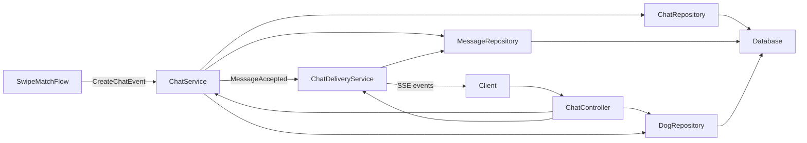
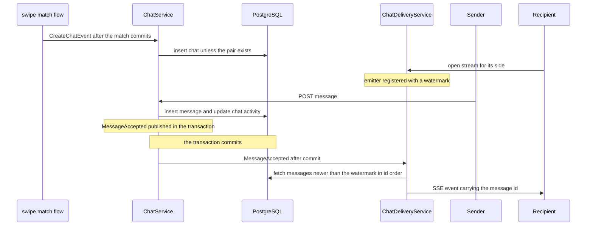

# Design — post-match-chat

## Overview

**Purpose**: this feature gives the two sides of a mutual match an in-app chat: a conversation created automatically when the match flow fires `CREATE_CHAT`, plain-text messaging, live delivery to connected sides, and full history. It delivers the F-09 value from `docs/PRD.md` — owners arrange a meeting without leaving the product.

**Users**: the owners of the two matched dogs, represented in this slice by their dogs (no owner or auth model exists yet). The second consumer is the future swipe/match flow (F-07/F-08), which publishes the `CreateChatEvent` this feature consumes.

**Impact**: adds a new `chat` package — a vertical slice following the existing `dog`/`match` pattern — with two tables, one inbound cross-feature event, one internal event, and one SSE stream endpoint. No existing file changes except the Liquibase index. No new dependencies.

### Goals
- One chat per mutual match, created by the `CREATE_CHAT` event, idempotently.
- Participant-only plain-text messaging with immutable history.
- Live delivery to a connected side within 1 s p95 (NFR-08), ordered, without loss or duplicates (NFR-09).
- History and chat discovery for participants only.

### Non-Goals
- Swipe, mutual-match logic, and the emission of `CREATE_CHAT` (F-07/F-08).
- Owner/user identity and authentication (F-01); message edit/delete; chat close/archive; read receipts; typing indicators; mobile push for new messages; media; moderation (F-10); retention policies (PRD open question Q3).

## Boundary Commitments

### This Spec Owns
- The `chat` package: `Chat`/`Message` persistence, domain rules, HTTP surface, live delivery.
- The `CreateChatEvent` contract: payload, semantics, idempotency rules.
- Tables `chat` and `message` with their constraints and indexes.
- The SSE stream contract for chat message delivery (event shape, `Last-Event-ID` replay).

### Out of Boundary
- How and when `CREATE_CHAT` is emitted: F-07/F-08 own the emitter. This feature assumes the event arrives after the match is durably established.
- Match notifications (F-08) and any notification about new chat messages.
- Identity: the `dogId` parameters are an auth stand-in; real authentication is F-01.
- Blocking/reporting enforcement (F-10): when it lands, blocking must gate chat access; this design does not implement it.
- Retention and deletion of chat content (PRD open question Q3).

### Allowed Dependencies
- `dog` package: `Dog` and `DogRepository`, read-only (chat reads from dog; dog knows nothing of chat).
- Spring Web MVC (`spring-boot-starter-web`), Spring Data JPA, Jakarta Validation, Liquibase — all already declared; **no new dependencies**.
- Spring's in-process `ApplicationEventPublisher` for both events.
- Dependency direction inside the slice: entities/repositories → service → delivery → controller; controllers import services and repositories, never the other way up. The future swipe/match flow may depend on `chat`'s event contract (one-way, acyclic: match → chat → dog).

### Revalidation Triggers
- F-07/F-08 define a different event name, payload, or firing semantics than `CreateChatEvent`.
- F-01 (auth) lands: every `dogId` parameter must be replaced by the authenticated owner's dog.
- F-10 (blocking) lands: send, stream, and history must consult block state.
- The chat ever moves out of this process: in-process Spring events stop working; `CreateChatEvent` must become a cross-service contract.
- Client teams adopt a live channel other than SSE.

## Architecture

### Existing Architecture Analysis
- Package-per-concept vertical slices (`dog`, `match`): thin controllers, domain rules in services, Spring Data repositories, no `@ControllerAdvice` (controllers translate errors via `ResponseEntity`).
- Liquibase is the only schema authority: plain-SQL changesets under a YAML index, `ddl-auto: validate`; changesets are immutable once run.
- Tests are unit-level: services instantiated directly, no Spring context, no database (`mise run test` needs no DB).
- No stored match concept exists today — compatibility is computed per request. This feature introduces the first persisted match-derived state.

### Architecture Pattern & Boundary Map



Key decisions:
- Selected pattern: a new vertical-slice package, same as `dog`/`match`. The only cross-feature seam is the in-process `CreateChatEvent`.
- The two event arrows run through Spring's `ApplicationEventPublisher`: `ChatService` publishes `MessageAcceptedEvent` inside the send transaction; `ChatDeliveryService` consumes it `AFTER_COMMIT`, so only committed messages are ever pushed.
- Existing patterns preserved: constructor injection, `ResponseEntity` translation, repository interfaces, plain-SQL Liquibase migrations.
- New component rationale: `ChatDeliveryService` is separate from `ChatService` because live delivery is stateful (connection registry, per-listener watermarks) and must not sit inside the transactional service.

### Technology Stack

| Layer | Choice / Version | Role in Feature | Notes |
|-------|------------------|-----------------|-------|
| Backend | Spring Boot 4.1, servlet MVC | REST endpoints, SSE stream | `SseEmitter` is core `spring-webmvc` — no new starter (verified against Framework 7 docs) |
| Events | Spring application events | `CreateChatEvent` ingestion, post-commit delivery trigger | in-process only |
| Data | PostgreSQL 18, Spring Data JPA, Hibernate 7 | chat/message persistence | UTC timestamps via existing Hibernate config |
| Schema | Liquibase, plain SQL | one new changeset file | appended to the master index |
| Tests | JUnit 5, AssertJ, Mockito | unit-level, no Spring context | Mockito already on the test classpath, used here for the first time |

## File Structure Plan

### Directory Structure
```
src/main/kotlin/com/ai4dev/tinder4dogs/chat/
├── CreateChatEvent.kt      # the cross-feature contract: payload + emission semantics in KDoc
├── Chat.kt                 # Chat entity
├── Message.kt              # Message entity
├── ChatRepository.kt       # Spring Data: canonical pair lookup, participant chat list
├── MessageRepository.kt    # Spring Data: history, catch-up, newest-id queries
├── ChatService.kt          # domain rules; CreateChatEvent listener; MessageAcceptedEvent; MAX_MESSAGE_LENGTH
├── ChatDeliveryService.kt  # SSE registry, per-listener watermark push, AFTER_COMMIT listener
└── ChatController.kt       # HTTP surface + MessageRequest, MessageResponse, ChatSummaryResponse
src/main/resources/db/changelog/changes/005-create-chat.sql
src/test/kotlin/com/ai4dev/tinder4dogs/chat/
├── ChatServiceTest.kt
└── ChatDeliveryServiceTest.kt
```

### Modified Files
- `src/main/resources/db/changelog/db.changelog-master.yaml` — append the `005-create-chat.sql` include. Nothing else in the repository changes.

## System Flows



Flow decisions:
- An invalid `CreateChatEvent` (unknown dog, same dog twice) is logged WARN and swallowed: a committed match must not fail because chat creation declined.
- Sends to one chat are serialized end-to-end by the advisory lock (held until commit), and pushes run on an executor after commit: a sender's response time never depends on a recipient's connection.
- A fresh stream connection starts at the chat's newest message — history comes from the GET endpoint. A reconnection may send `Last-Event-ID` to replay what was missed.

## Requirements Traceability

| Requirement | Summary | Components | Interfaces | Flows |
|-------------|---------|------------|------------|-------|
| 1.1 | chat created on `CREATE_CHAT` for a valid pair | ChatService, CreateChatEvent, ChatRepository | Event | creation |
| 1.2 | duplicate event reuses the existing chat | ChatService, ChatRepository, `uq_chat_pair` | Event | creation |
| 1.3 | invalid event rejected, no chat, no crash | ChatService | Event | creation |
| 1.4 | messaging only inside a mutual-match chat | ChatService, ChatController | API | |
| 2.1 | valid message accepted with sender and time | ChatService, MessageRepository, MessageAcceptedEvent | Service, API | send |
| 2.2 | blank or over-length text rejected | MessageRequest, ChatService, `VARCHAR(2000)` | API | |
| 2.3 | non-participant sender rejected | ChatService.visibleChat, ChatController | API, Service | |
| 2.4 | accepted messages never change | structural: no mutation path exists | | |
| 3.1 | ≤ 1 s p95 live delivery | ChatDeliveryService | Event, API stream | send |
| 3.2 | delivery in acceptance order | ChatService (per-chat send lock), ChatDeliveryService, MessageRepository | | send |
| 3.3 | offline side: message stays stored | ChatService, MessageRepository | API | send |
| 3.4 | no loss, no duplicates | ChatDeliveryService watermark, `Last-Event-ID` | API stream | send |
| 4.1 | full history in order for participants | ChatService, MessageRepository | API | |
| 4.2 | message carries side, text, time | MessageResponse | API | |
| 4.3 | non-participant reads rejected | ChatService.visibleChat, ChatController | API | |
| 5.1 | all chats of a dog, most recently active first | ChatRepository, ChatController, DogRepository | API | |
| 5.2 | chat shows other dog and last activity | ChatController, ChatSummaryResponse | API | |

## Components and Interfaces

| Component | Domain/Layer | Intent | Req Coverage | Key Dependencies | Contracts |
|-----------|--------------|--------|--------------|------------------|-----------|
| CreateChatEvent | chat / contract | the single interface to F-07/F-08 | 1.1–1.3 | published by the future match flow | Event |
| ChatService | chat / domain | creation, participant access, messaging, history, discovery rules | 1.x, 2.x, 4.x, 5.x | DogRepository (P0), ChatRepository (P0), MessageRepository (P0), ApplicationEventPublisher (P0) | Service, Event |
| ChatDeliveryService | chat / runtime | SSE registry and ordered, exactly-once push | 3.1–3.4 | MessageRepository (P0) | Service, Event, State |
| ChatController | chat / HTTP | REST + SSE surface, error translation | 2.x, 4.x, 5.x, 3.x | ChatService (P0), ChatDeliveryService (P0), DogRepository (P1) | API |
| ChatRepository, MessageRepository | chat / persistence | Spring Data access | all | JPA (P0) | — |
| Chat, Message | chat / model | persistence shape | all | — | State |

### chat / contract

#### CreateChatEvent

| Field | Detail |
|-------|--------|
| Intent | the event fired at the end of a successful swipe + mutual match, asking for a chat to exist |
| Requirements | 1.1, 1.2, 1.3 |

Payload: `data class CreateChatEvent(val dogAId: Long, val dogBId: Long)` — the dog ids are unordered.
- **Delivery**: Spring `ApplicationEventPublisher`, synchronous, in-process. Emitted by the F-07/F-08 flow once the match is durably established, with both dog ids valid and distinct.
- **Idempotency**: consumer-side — the same pair always resolves to the same chat.
- **Rejection**: the listener logs WARN with the reason and creates nothing; it never throws into the emitter's flow (deliberate deviation from the `require` convention, contained by design).
- **Schema evolution**: an in-process class versioned by the owning package; any rename or reshape is a revalidation trigger for F-07/F-08.

### chat / domain

#### ChatService

| Field | Detail |
|-------|--------|
| Intent | owns every domain rule: chat creation, participant access, message acceptance, history, discovery |
| Requirements | 1.1, 1.2, 1.3, 2.1, 2.3, 2.4, 4.1, 4.3, 5.1 |

**Responsibilities & Constraints**
- Creation (`onMatched`) is idempotent: canonical pair `(min, max)`, lookup first, insert on miss; a concurrent duplicate insert fails on `uq_chat_pair` and re-fetches the existing chat.
- `visibleChat` answers "does this chat exist *for this dog*": `null` when the chat is absent **or** the dog is not a participant — one rule for send, read, and listen access.
- `send` requires, at the top: the sender participates in the chat, and the text is non-blank and at most `MAX_MESSAGE_LENGTH` (2000). It acquires the per-chat send lock, inserts the message, sets `Chat.lastMessageAt`, and publishes `MessageAcceptedEvent(chatId, messageId)` — all in one transaction.
- **Per-chat send lock**: `send` first acquires a transaction-scoped PostgreSQL advisory lock (`pg_advisory_xact_lock`, via a `ChatRepository` method) keyed on the chat id, held until commit. This orders id assignment *and* commit per chat, which is the precondition the watermark delivery relies on: a lower id can no longer commit after a higher id, so the watermark can never advance past an uncommitted message. A rolled-back send leaves an id hole — harmless, since that id never existed.
- `send` is the only write path for messages; no update or delete operation exists anywhere in the package (2.4).
- The file also declares `MessageAcceptedEvent` (internal contract) and the shared `const val MAX_MESSAGE_LENGTH = 2000`, used by both the request DTO's `@Size` and the service `require`.

**Dependencies**
- Outbound: DogRepository — dog existence at creation (P0); ChatRepository, MessageRepository (P0); ApplicationEventPublisher (P0).
- Inbound: ChatController (P0); the future swipe/match flow via `CreateChatEvent` (P0).

**Contracts**: Service [x] / Event [x]

##### Service Interface
```kotlin
class ChatService(
    private val dogs: DogRepository,
    private val chats: ChatRepository,
    private val messages: MessageRepository,
    private val events: ApplicationEventPublisher,
) {
    fun onMatched(event: CreateChatEvent): Chat?      // idempotent; logs and returns null on an invalid event
    fun visibleChat(chatId: Long, dogId: Long): Chat? // null = no chat visible to this dog
    fun send(chat: Chat, senderDogId: Long, text: String): Message
    fun history(chat: Chat): List<Message>            // acceptance order
    fun chatsOf(dogId: Long): List<Chat>              // most recently active first; caller resolves dog existence
}
```
- Preconditions: `send` requires a participating sender and valid text (`require` at the top); `history`/`send` receive a chat the requester was already proven to see.
- Postconditions: `send` returns a persisted, ordered, immutable message and has published `MessageAcceptedEvent` in the same transaction; `onMatched` leaves exactly one chat for the pair.
- Invariants: one chat per dog pair; `dogAId < dogBId`; messages exist only within chats, and only via `send`.
- Errors: `require` failures surface as `IllegalArgumentException`; no controller path relies on them (the controller checks `visibleChat` first) — they are a misuse guard, not an HTTP error source.

### chat / runtime

#### ChatDeliveryService

| Field | Detail |
|-------|--------|
| Intent | pushes accepted messages to connected sides over SSE — ordered, exactly once per listener |
| Requirements | 3.1, 3.2, 3.4 |

**Responsibilities & Constraints**
- Holds in-memory listener state per chat: emitter, listener dog id, watermark (highest message id sent), and a per-listener lock.
- `openStream` registers an emitter and sets the watermark: from the `Last-Event-ID` header when present, otherwise to the chat's current newest message id (fresh connections receive only future messages — history is the GET endpoint).
- On `MessageAcceptedEvent` (`@TransactionalEventListener`, AFTER_COMMIT): the listener hands the push to a bounded Spring-managed executor and returns immediately — a slow recipient never delays the sender's response. The worker then, for each listener of that chat, under the listener's lock, fetches `chat_id = X and id > watermark order by id asc`, sends each message as an SSE event (`id` = message id, name `message`, data = `MessageResponse`), advancing the watermark. Because the worker re-fetches everything above the watermark, executor dispatch order is irrelevant.
- Ids at or below the watermark are never re-sent: that single rule provides ordering (3.2), no duplicates (3.4), and reconnect replay — correct because the per-chat send lock in `ChatService` makes id order equal commit order per chat, so the watermark cannot advance past an uncommitted message.
- Delivery reaches every connected listener of the chat, including the sender's own other connections; the 1-second guarantee (3.1) targets the other side. Uniform delivery keeps a sender's tabs consistent without a richer contract.
- Emitters are created with an explicit no-timeout choice (`SseEmitter(0L)`), so idle streams stay open in v1. `onCompletion` / `onTimeout` / `onError` unregister the listener.

**Dependencies**
- Outbound: MessageRepository — catch-up fetch and newest-id lookup (P0).
- Inbound: ChatController (P0); ChatService via `MessageAcceptedEvent` (P0).

**Contracts**: Service [x] / Event [x] / State [x]

##### Service Interface
```kotlin
class ChatDeliveryService(private val messages: MessageRepository) {
    fun openStream(chatId: Long, listenerDogId: Long, lastEventId: Long?): SseEmitter
    fun onMessageAccepted(event: MessageAcceptedEvent)  // AFTER_COMMIT
}
```
- Preconditions: the caller has already proven the chat exists and the listener participates.
- Postconditions: each listener eventually holds every accepted message above its watermark, in id order, at most once.
- Invariants: the watermark only grows; no send happens outside a listener lock; push work never runs on the sender's request thread.
- Errors: a failing or dead emitter is unregistered and logged; the message stays stored — no loss.

### chat / HTTP

#### ChatController

| Field | Detail |
|-------|--------|
| Intent | REST and SSE surface; translates absence to 404 and validates request shape |
| Requirements | 1.4, 2.1–2.3, 3.1, 3.4, 4.1–4.3, 5.1, 5.2 |

**Responsibilities & Constraints**
- No domain rules. Bean Validation guards request shape; `visibleChat` returning null becomes 404; the dog-existence check for discovery uses `DogRepository` directly (same pattern as `MatchController`); the other dog's name for summaries is fetched via `DogRepository` (presentational enrichment).
- Stream endpoint: proves participant access through `ChatService.visibleChat` first, then delegates to `ChatDeliveryService`.

**Dependencies**
- Outbound: ChatService (P0), ChatDeliveryService (P0), DogRepository (P1).

**Contracts**: API [x]

##### API Contract

| Method | Endpoint | Request | Response | Errors |
|--------|----------|---------|----------|--------|
| POST | `/api/chats/{chatId}/messages` | `MessageRequest` | 201 `MessageResponse` | 400 invalid shape; 404 unknown chat or non-participant sender |
| GET | `/api/chats/{chatId}/messages?dogId=` | — | 200 `List<MessageResponse>` | 404 unknown chat or non-participant requester |
| GET | `/api/chats?dogId=` | — | 200 `List<ChatSummaryResponse>` | 404 unknown dog |
| GET | `/api/chats/{chatId}/stream?dogId=` | optional `Last-Event-ID` header | 200 `text/event-stream`; SSE events named `message`, `id` = message id, `data` = `MessageResponse` | 404 unknown chat or non-participant listener |

`dogId` query parameters are the documented stand-in for the authenticated owner until F-01 exists.

Client integration for the stream: open the stream *before* fetching history, then reconcile by message id — this closes the window in which a message accepted between the history GET and the stream open would otherwise be missed on both channels. Reconnecting clients send the SSE `Last-Event-ID` header, which the server honors as the replay cursor.

##### Request/Response Shapes
- `MessageRequest`: `senderDogId: Long` (`@field:NotNull @field:Positive`), `text: String` (`@field:NotBlank`, `@field:Size(max = MAX_MESSAGE_LENGTH)`).
- `MessageResponse`: `id`, `senderDogId`, `text`, `acceptedAt` — companion `of(Message)` factory, used for the REST response and the SSE payload alike.
- `ChatSummaryResponse`: `chatId`, `otherDogId`, `otherDogName`, `lastMessageAt` (nullable — no message yet).

### chat / persistence

#### ChatRepository — `JpaRepository<Chat, Long>`
- `findByDogAIdAndDogBId(a: Long, b: Long): Chat?` — canonical pair lookup for idempotency.
- `lockById(chatId: Long)` — native `@Query` `SELECT pg_advisory_xact_lock(:chatId)`: transaction-scoped, held until commit; serializes sends per chat.
- `findAllByParticipantOrderByLastActivity(dogId: Long): List<Chat>` — JPQL `@Query`: chats where the dog is either side, ordered by `coalesce(c.lastMessageAt, c.createdAt)` descending.

#### MessageRepository — `JpaRepository<Message, Long>`
- `findAllByChatIdOrderByIdAsc(chatId: Long): List<Message>` — history in acceptance order.
- `findAllByChatIdAndIdGreaterThanOrderByIdAsc(chatId: Long, afterId: Long): List<Message>` — watermark catch-up.
- `findFirstByChatIdOrderByIdDesc(chatId: Long): Message?` — newest id to seed fresh-stream watermarks.

### chat / model

#### Chat / Message (entities)
JPA-pragmatic mutable classes in the `Dog` style. `Chat`: `id`, `dogAId`, `dogBId` (plain `Long` columns, not associations — the codebase has no `@ManyToOne`, and plain ids keep lazy-loading out of an `open-in-view: false` service), `createdAt`, `lastMessageAt` (nullable). `Message`: `id`, `chatId`, `senderDogId`, `text`, `acceptedAt`. Timestamps are `Instant`, assigned by the service, stored as UTC.

## Data Models

### Domain Model
- Aggregate: a `Chat` with its `Message`s; the chat is the transaction boundary for sends.
- Invariants: `dogAId < dogBId`; one chat per pair; a message's sender is one of the chat's two dogs; messages are immutable once accepted.
- Domain events: `CreateChatEvent` (inbound, cross-feature), `MessageAcceptedEvent` (internal, post-commit trigger).

### Physical Data Model
Changeset file `005-create-chat.sql`, appended to the master index. Two changesets, each with an explicit `--rollback`; immutable once run anywhere (fix mistakes with the next changeset, never by editing):

```sql
--changeset tinder4dogs:005-create-chat
CREATE TABLE chat (
    id              BIGINT GENERATED BY DEFAULT AS IDENTITY PRIMARY KEY,
    dog_a_id        BIGINT NOT NULL,
    dog_b_id        BIGINT NOT NULL,
    created_at      TIMESTAMP WITH TIME ZONE NOT NULL,
    last_message_at TIMESTAMP WITH TIME ZONE,
    CONSTRAINT fk_chat_dog_a FOREIGN KEY (dog_a_id) REFERENCES dog (id),
    CONSTRAINT fk_chat_dog_b FOREIGN KEY (dog_b_id) REFERENCES dog (id),
    CONSTRAINT uq_chat_pair UNIQUE (dog_a_id, dog_b_id),
    CONSTRAINT ck_chat_pair_order CHECK (dog_a_id < dog_b_id)
);
--rollback DROP TABLE chat;

--changeset tinder4dogs:006-create-message
CREATE TABLE message (
    id            BIGINT GENERATED BY DEFAULT AS IDENTITY PRIMARY KEY,
    chat_id       BIGINT NOT NULL,
    sender_dog_id BIGINT NOT NULL,
    text          VARCHAR(2000) NOT NULL,
    accepted_at   TIMESTAMP WITH TIME ZONE NOT NULL,
    CONSTRAINT fk_message_chat FOREIGN KEY (chat_id) REFERENCES chat (id),
    CONSTRAINT fk_message_dog  FOREIGN KEY (sender_dog_id) REFERENCES dog (id)
);
CREATE INDEX idx_message_chat_id_id ON message (chat_id, id);
--rollback DROP TABLE message;
```

- `uq_chat_pair` with `ck_chat_pair_order` implements idempotent creation (1.2) at storage level, and is the backstop for the concurrent-duplicate race.
- `VARCHAR(2000)` backs 2.2 at storage level. Non-blank text is enforced by Bean Validation and the service `require` — deliberately no `CHECK` for it, matching the codebase's light-constraint style (the `age` column famously has none either).
- The `(chat_id, id)` index serves history and catch-up fetches.

No data migration: new tables only; Liquibase applies the changeset at startup.

## Error Handling

| Situation | Behavior | Requirement |
|----------|----------|-------------|
| Invalid message shape (blank text, over 2000 chars, missing sender) | Bean Validation → 400, nothing recorded | 2.2 |
| Unknown chat, or sender/requester/listener is not a participant | `visibleChat` returns null → controller answers 404 (non-disclosure: an outsider cannot distinguish "exists" from "not for you") | 2.3, 4.3 |
| Unknown dog in chat discovery | controller's `DogRepository` lookup misses → 404 | 5.1 |
| Invalid `CreateChatEvent` (unknown dog, same dog twice, null id) | listener logs WARN with the reason, creates nothing, does not throw into the emitter | 1.3 |
| Concurrent duplicate `CreateChatEvent` | unique-constraint violation on insert → re-fetch the existing chat | 1.2 |
| Dead or unreachable SSE emitter | send failure caught, listener unregistered, message stays stored | 3.3, 3.4 |
| Concurrent sends to one chat | per-listener lock + watermark catch-up guarantee order and no duplicates | 3.2, 3.4 |

Monitoring: no metrics infrastructure exists; v1 logs rejections and delivery failures at WARN. No `@ControllerAdvice` is introduced (structure.md: a centralized handler would be its own structural change); controllers translate their own outcomes.

## Testing Strategy

Unit-level only, per `tech.md` — `mise run test`, no database, no Spring context. Mockito mocks the repositories and the event publisher (already on the test classpath, used here for the first time). Assertions target relations (ordering, contents), never magic numbers.

### ChatServiceTest
- `creating a chat for a matched pair stores the pair in canonical order` — pins 1.1.
- `a duplicate create chat event returns the existing chat instead of saving a second one` — pins 1.2.
- `a create chat event for an unknown dog is rejected without saving` — pins 1.3 (dog-missing case).
- `a create chat event naming the same dog twice is rejected without saving` — pins 1.3 (same-dog case).
- `sending a message as a participant records it with sender and time and publishes the accepted event` — pins 2.1 (publisher verified with the persisted id; `lastMessageAt` updated).
- `sending acquires the per chat lock before inserting` — pins the serialization precondition behind 3.2/3.4 (red if the lock call is removed).
- `sending blank or over-long text is rejected` — pins 2.2 at the service `require` (the 400 is the DTO's job, tested implicitly by validation annotations).
- `a chat is not visible to a dog outside it` — pins 2.3 and 4.3 (the single access rule).
- `history returns the accepted messages in order` — pins 4.1.
- `chats of a dog are ordered most recently active first` — pins 5.1 (ordering asserted as a relation, including a chat with no messages yet).

### ChatDeliveryServiceTest (SseEmitter and executor mocked — the executor runs pushes synchronously in tests; event ids captured in order)
- `a connected listener receives the accepted message after the event fires` — pins 3.1's path.
- `accepted events arriving out of id order are delivered in id order` — pins 3.2.
- `a listener never receives a message twice` — pins 3.4 (watermark blocks the second push).
- `reconnecting with Last-Event-ID replays only newer messages` — pins 3.4 (replay).
- `a fresh stream starts at the newest message` — pins the 3.3 boundary: history is not replayed on connect.
- `a failing emitter is unregistered and the failure does not propagate` — pins delivery resilience behind 3.3/3.4.

### Explicitly not covered by unit tests
- HTTP/SSE wire behavior and JSON serialization: the whole HTTP and persistence surface of this codebase is untested today (structure.md, known inconsistencies); this feature keeps that status quo rather than half-introducing `@WebMvcTest` for one controller.
- 2.4 is structural — no mutation operation exists to call. It is enforced by review and by the absence of any update/delete path, not by a test that could only assert a green path.

## Security Considerations
- `dogId` parameters are spoofable by design: they are the documented stand-in until F-01 (auth). Every access decision treats the dog id as the identity claim.
- Non-disclosure: unknown chat and non-participant both answer 404, so existence of a chat cannot be probed by outsiders.
- Chat text is user-generated content: all persistence is parameterized (JPA); there is no server-side HTML rendering, so injection surfaces are the clients' concern.
- Chat content is personal data under nLPD/GDPR; retention and deletion are out of scope here and must be answered before launch (PRD open question Q3).

## Performance
- 3.1 latency budget: in-process event + one indexed catch-up query + one SSE write — far inside 1 s at v1 scale. No measurement infrastructure exists, so the p95 is a design property, not a monitored SLA.
- The listener registry is unbounded in v1 (one entry per open connection): acceptable at launch scale; cap when there is a measured reason.
- Servlet async releases request threads; SSE connections do not pin Tomcat threads.
- Push work runs on a small bounded executor (a Spring-managed bean, shut down with the context); a slow or blocked recipient cannot stall a sender's response.
- Deployment note: reverse proxies must not buffer `text/event-stream` (disable proxy buffering for the stream endpoint).